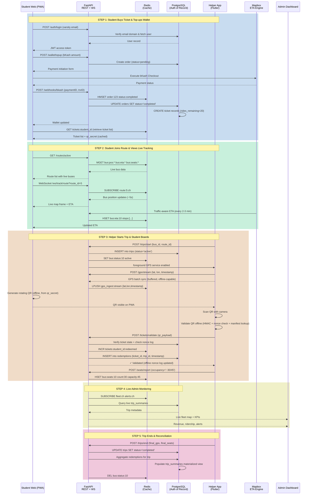
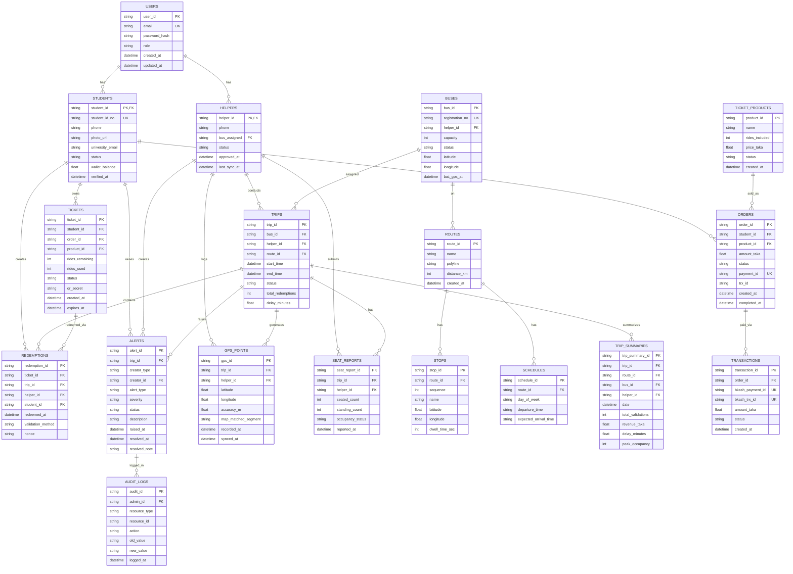
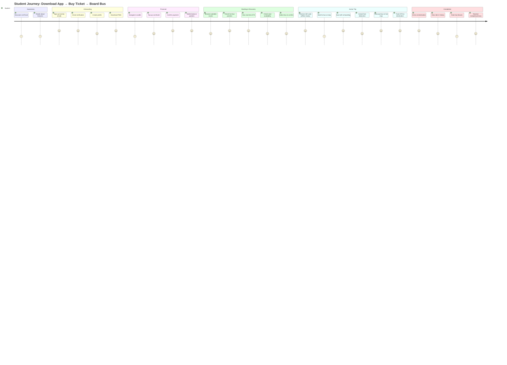

# UniTrack BD — Required Diagrams (Mermaid)

---

## TECHNICAL PERSPECTIVE

### 1. Use Case Diagram

```mermaid
graph TB
    Student["👤 Student"]
    Helper["👤 Helper"]
    Admin["👤 Admin"]
    System["UniTrack System"]
    bKash["💳 bKash"]
    Mapbox["🗺️ Mapbox"]
    FCM["🔔 Firebase FCM"]

    Student -->|Register & Login| System
    Student -->|Buy Tickets| System
    Student -->|Top-up Wallet| bKash
    bKash -->|Payment Webhook| System
    Student -->|Track Live Bus| System
    System -->|Request Traffic Data| Mapbox
    Student -->|View ETA| System
    Student -->|Show QR Code| Helper
    Student -->|Raise Emergency Alert| System
    Student -->|View Ride History| System

    Helper -->|Register| System
    System -->|Admin Approval| Helper
    Helper -->|Start/End Trip| System
    Helper -->|Stream GPS Data| System
    Helper -->|Scan QR Code| System
    System -->|Validate QR Offline| Helper
    Helper -->|Report Seats| System
    Helper -->|Raise SOS Alert| System
    Helper -->|Sync Data| System

    Admin -->|Login| System
    Admin -->|CRUD Buses/Routes| System
    Admin -->|Manage Helpers| System
    Admin -->|Manage Students| System
    Admin -->|View Revenue Dashboard| System
    Admin -->|View Ridership Dashboard| System
    Admin -->|View Live Fleet Map| System
    Admin -->|Manage Alerts| System
    Admin -->|View Trip History| System
    Admin -->|Export Reports| System

    System -->|Send Push Notifications| FCM

    style Student fill:#dbeafe,stroke:#2563eb,color:#1e3a5f
    style Helper fill:#dbeafe,stroke:#2563eb,color:#1e3a5f
    style Admin fill:#dbeafe,stroke:#2563eb,color:#1e3a5f
    style System fill:#dcfce7,stroke:#16a34a,color:#14532d
    style bKash fill:#fee2e2,stroke:#dc2626,color:#7f1d1d
    style Mapbox fill:#fee2e2,stroke:#dc2626,color:#7f1d1d
    style FCM fill:#fee2e2,stroke:#dc2626,color:#7f1d1d
```

---

### 2. Sequence Diagram (Complete Boarding & Validation Flow)

---

### 3. Entity Relationship Diagram (ERD)

---

## PRODUCT PERSPECTIVE

### 4. User Journey Map (Student — From Discovery to Arrival)

---

### 5. User Flow (Core UI Paths)

```mermaid
flowchart TD
    A["🚀 App Launch"] --> B{"Logged In?"}
    B -->|No| C["📝 Login / Sign-up Screen"]
    C --> C1{"User Type?"}
    C1 -->|Student| C2["Email Verification<br/>varsity domain check"]
    C1 -->|Helper| C3["Awaiting Admin<br/>Approval"]
    C2 --> D["✅ Dashboard"]
    C3 --> C3A["Helper Status:<br/>Pending"]

    B -->|Yes| D

    D --> D1{"Role?"}

    D1 -->|Student| S["📱 STUDENT FLOW"]
    D1 -->|Helper| H["🚗 HELPER FLOW"]
    D1 -->|Admin| AD["⚙️ ADMIN FLOW"]

    subgraph S["STUDENT FLOW"]
        S1["🏠 Home Dashboard<br/>- Active routes<br/>- Wallet balance"]
        S1 --> S2{"Next Action?"}
        S2 -->|View Route| S3["🗺️ Live Route Screen<br/>- Bus position<br/>- ETA per stop<br/>- Seat availability"]
        S2 -->|Top-up Wallet| S4["💳 Wallet Top-up<br/>- Enter amount<br/>- bKash redirect<br/>- Confirm payment"]
        S2 -->|History| S5["📋 Ride History<br/>- Past trips<br/>- Receipts<br/>- Fare details"]
        S3 --> S6["🎫 Ticket & QR<br/>- Display QR code<br/>- Works offline<br/>- Auto-rotate"]
        S4 --> S7["✅ Payment Success<br/>- Wallet updated<br/>- Tickets added"]
        S6 --> S8["🚍 Board Bus<br/>- Helper scans QR<br/>- Fare deducted<br/>- Ride active"]
        S8 --> S9["🚗 In Transit<br/>- Live GPS tracking<br/>- ETA countdown<br/>- SOS button"]
        S9 --> S10["🏁 Arrived<br/>- Trip complete<br/>- Receipt generated"]
        S10 --> S1
        S2 -->|Emergency| S11["🆘 Report Emergency<br/>- Type incident<br/>- Send to admins<br/>- Rate-limited"]
    end

    subgraph H["HELPER FLOW"]
        H1["🏠 Helper Dashboard<br/>- Today's trips<br/>- Bus assignment"]
        H1 --> H2{"Start Trip?"}
        H2 -->|Yes| H3["🚗 Trip Start<br/>- Select route<br/>- GPS enabled<br/>- Foreground service"]
        H3 --> H4["📡 GPS Streaming<br/>- Continuous location<br/>- Buffered offline<br/>- ~5s updates"]
        H4 --> H5["🎫 QR Validation<br/>- Scan QR code<br/>- Offline HMAC check<br/>- Nonce log"]
        H5 --> H6{"Valid?"}
        H6 -->|Yes| H7["✅ Fare Deducted<br/>- Sync later if offline<br/>- Nonce recorded"]
        H6 -->|No| H8["❌ Invalid Ticket<br/>- Student ID fallback<br/>- Manual redemption"]
        H4 --> H9["👥 Report Seats<br/>- Tap occupancy<br/>- Seated / Standing / Full"]
        H9 --> H10["💾 Seat Report Sent"]
        H7 --> H11["🆘 Emergency Button<br/>- One-tap SOS<br/>- Trip attached<br/>- Priority queue"]
        H11 --> H12["📤 Offline Alert Sync<br/>- Queued if offline"]
        H4 --> H13{"End Trip?"}
        H13 -->|Yes| H14["🏁 Trip End<br/>- Finalize GPS<br/>- Final seat report<br/>- Close trip"]
        H14 --> H1
    end

    subgraph AD["ADMIN FLOW"]
        AD1["📊 Admin Dashboard<br/>- KPIs<br/>- Revenue today<br/>- Active buses<br/>- Open alerts"]
        AD1 --> AD2{"Module?"}
        AD2 -->|Live Fleet| AD3["🗺️ Live Fleet Map<br/>- All buses + heading<br/>- Delay vs schedule<br/>- Occupancy estimate<br/>- GPS freshness"]
        AD2 -->|Revenue| AD4["💰 Revenue Dashboard<br/>- By day/week/month<br/>- By route/product<br/>- Package uptake"]
        AD2 -->|Ridership| AD5["📈 Ridership Analytics<br/>- Occupancy trends<br/>- Peak-hour curves<br/>- Sold vs validated gap"]
        AD2 -->|Management| AD6["⚙️ Management CRUD<br/>- Buses<br/>- Routes & stops<br/>- Schedules<br/>- Ticket products<br/>- Helpers<br/>- Students"]
        AD2 -->|Alerts| AD7["🚨 Emergency Console<br/>- Open alerts<br/>- Acknowledge<br/>- Resolve with note<br/>- Critical → email"]
        AD2 -->|Transactions| AD8["💳 Wallet & Transactions<br/>- Order browser<br/>- Refund initiation<br/>- Reconciliation queue"]
        AD2 -->|Trip History| AD9["🚌 Trip History<br/>- Searchable trips<br/>- GPS playback<br/>- Redemption list<br/>- Seat timeline"]
        AD3 --> AD10["📍 Click Bus<br/>- Trip drawer<br/>- Helper info<br/>- Route progress<br/>- Recent redemptions"]
        AD6 --> AD11["✏️ Edit Resource<br/>- Form submission<br/>- Audit log entry"]
        AD7 --> AD12["✅ Resolve Alert<br/>- Add resolution note<br/>- Broadcast to all"]
    end

    style S fill:#e0f2ff,stroke:#0284c7,color:#003d82
    style H fill:#e0ffe0,stroke:#16a34a,color:#143d2d
    style AD fill:#fff0e0,stroke:#ea580c,color:#5c2405
```

---

## USAGE

All diagrams are **Mermaid v11.12+** compatible. Use them in:
- **GitHub markdown** (auto-renders)
- **HTML/docs** (include mermaid.min.js + `
...
`)
- **Confluence, Notion, GitLab** (native Mermaid support)
- **Your team wiki/design doc**

Each diagram is self-contained and can be extracted independently.
